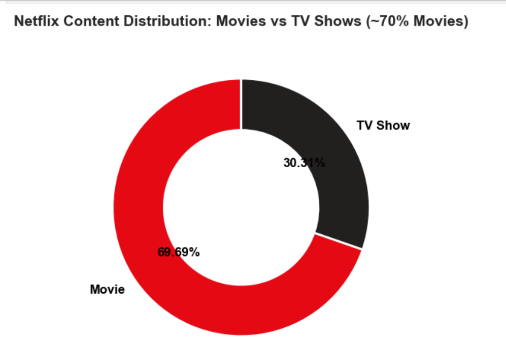
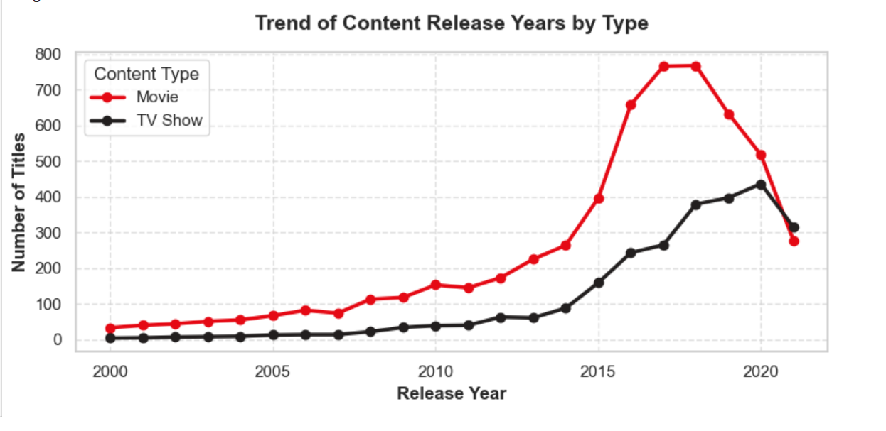
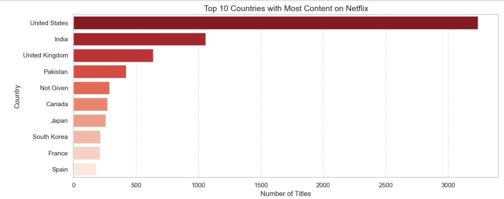
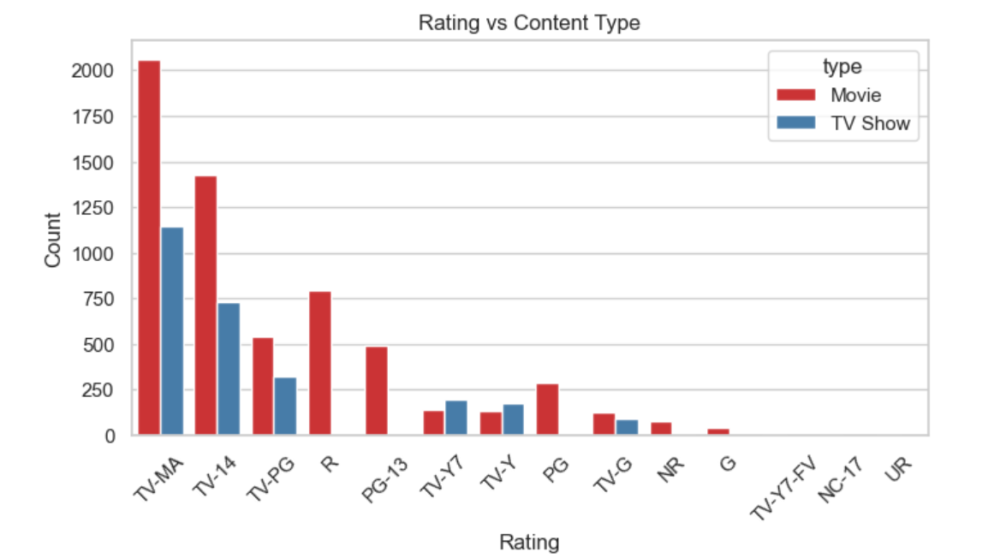
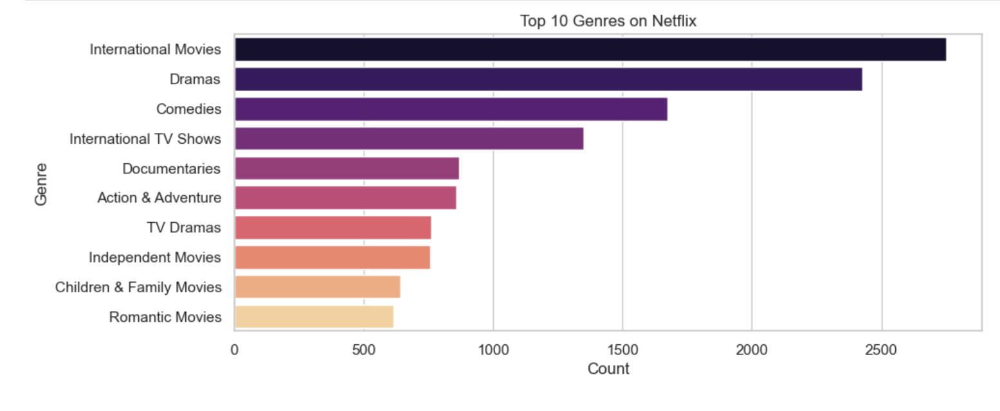

# 🎬 Netflix Content & Trend Analysis

An exploratory data analysis project examining Netflix's movie and TV show catalog using Python, NumPy, Pandas, Matplotlib, and Seaborn to uncover content trends and insights.

---

## 📊 Project Overview

This project explores the Netflix dataset to uncover structural trends regarding content distribution, geographic production footprints, historical growth trajectories, and data cleaning workflows. It transforms raw metadata into actionable insights suitable for media analytics and business strategy.

---

## 🛠️ Tech Stack & Libraries

* **Language**: Python
* **Data Manipulation & Cleaning**: Pandas, NumPy
* **Data Visualization**: Matplotlib, Seaborn
* **Environment**: Jupyter Notebook / VS Code

---

## 📈 Key Findings & Summary Metrics

* **Catalog Composition**: Analyzed a total of 8,790 titles on Netflix, comprising 6,126 movies and 2,664 TV shows. Movies significantly outnumber TV shows, accounting for roughly 70% of the catalog.
* **Geographic Production**: The United States and India contribute the largest share of global content production, reflecting strong local partnerships and massive target audiences.
* **Growth Trajectory**: Content additions grew exponentially over recent years, with the highest volume of additions peaking between 2019 and 2021 during Netflix's rapid global expansion phase.
* **Data Hygiene & Preprocessing**: Handled real-world data imperfections, such as addressing missing or placeholder director values (e.g., 'Not Given').

---

## 📉 Key Visualizations

### 1. Content Distribution (Movies vs. TV Shows)
Illustrates the core ratio of Movies versus TV Shows on the platform, showcasing movie dominance (~70%).


---

### 2. Content Growth Over Time (Trend Analysis)
Visualizes how Netflix's content library expanded over the years, mapping production booms and acquisition trends.


---

### 3. Top Content-Producing Countries
Showcases the global reach and geographic production hubs driving the platform's catalog.


---

### 4. Maturity Ratings Distribution
Highlights target audience demographics across the platform's titles (e.g., TV-MA, PG-13, TV-PG).


---

### 5. Top 10 Genres
Identifies the most prominent content categories available in the library (e.g., Dramas, International Movies, Comedies).


---

## 🚀 Future Scope & Next Steps

* **Content Recommendation System**: Extend this project by applying Natural Language Processing (NLP) on the `description` and `listed_in` columns to build a Content-Based Movie/Show Recommendation System.
* **Interactive Dashboard**: Export cleaned metrics into Power BI or Tableau to build an interactive media performance dashboard.

---

## 📁 Repository Structure

```text
├── Netflix.csv                      # Raw dataset used for analysis
├── Netflix-Content-Analysis.ipynb   # Complete Jupyter Notebook with code & charts
├── README.md                        # Project documentation
└── images/                          # Saved charts and visual assets
    ├── content_type_distribution.png
    ├── content_growth_over_time.png
    ├── top_countries.png
    ├── rating_distribution.png
    └── top_genres.png
